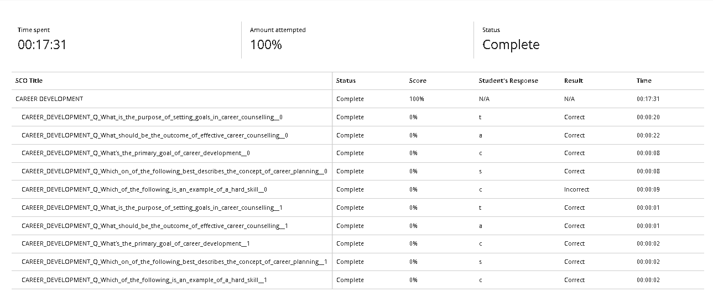

# Career Counselling

## Reflection (Using STAR Technique)

**Situation:** I started doing an online course about Career Development via Blackboard about my career, career paths of which it lays based on my interest.

**Task:** To understand which ICT field that best suits my strengths and interests.  

**Action:** I have started researching about an IT Technican, Junior Programmer.  

**Result:** I now know that I am best suited for IT related technical issues(hardware and software) and creating web inspired designs.
