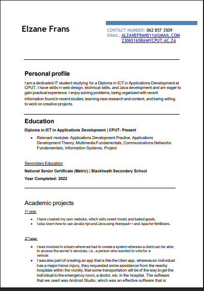

# Create a CV

## Evidence
I created a professional CV using Microsoft Word.  
[Download my CV here](files/Elzane_FransCV.pdf)

## Reflection (STAR)
**Situation:** I needed a strong CV to apply for internships and part-time jobs.  
**Task:** To gather all my personal, educational details into one document.  
**Action:** I created my CV using Microsoft Word and added my projects.  
**Result:** I now have a professional CV that shows employers what I can offer.
