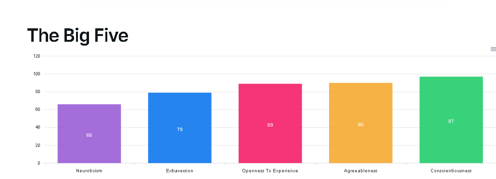

# Personality Assessment

## Evidence
I completed the Big Five Personality Test and got the following results:
- Openness: High
- Conscientiousness: High
- Extraversion: High
- Agreeableness: High
- Neuroticism: Medium

## Reflection (STAR)
**Situation:** I wanted to understand how my personality affects my learning and teamwork techniques.  
**Task:** To explore of my personality test results and apply them to my academic life.  
**Action:** I read about how introverts can still be effective communicators and team members.  
**Result:** I learned ways to contribute better in group work without needing to speak first.
