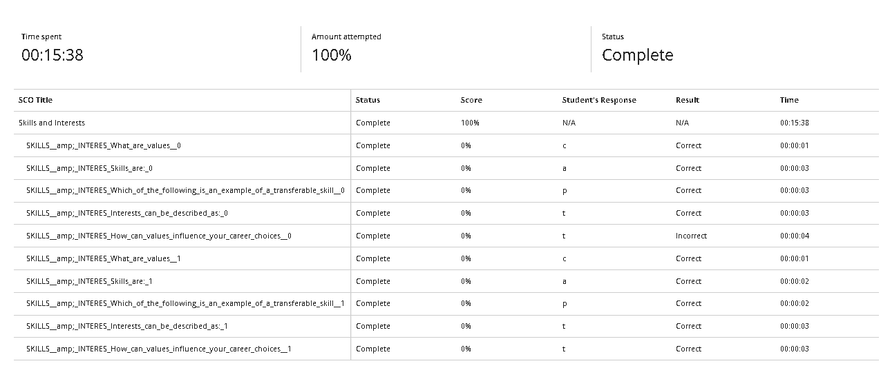
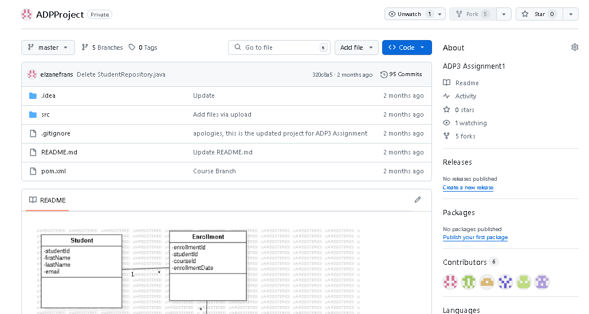

# Skills and Interests

## Evidence
Here are some of my key skills and interests:

- Programming: JavaScript, HTML and C++
- Tools: Visual Studio Code, GitHub, IntelliJ, Apache NetBeans
- Soft Skills: Teamwork, Communication, Organization,
- Interests: App/Wesbite development, web designing, solving technical issues

## Reflection (STAR)
**Situation:** During my second year, I realized I enjoyed working with code and solving logic problems.  
**Task:** To improve my programming skills and starting  
**Action:** I starting watching tutorials of Java, React, HTML and C++ and started building a website in first year.  
**Result:** I am more comfortable around it, and being interested about it and exploring other career paths relating about IT.
